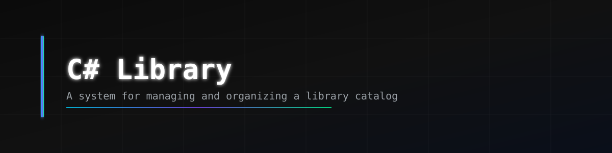
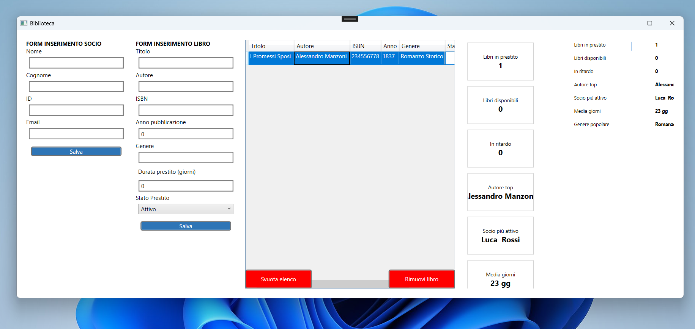

# CSharp Library 

Applicazione desktop per la gestione del catalogo di una biblioteca, sviluppata in **C# con WPF** seguendo il pattern architetturale **MVVM**.

---

## Anteprima



---

##  Funzionalità

- **Gestione libri** — inserimento, rimozione e visualizzazione del catalogo con titolo, autore, ISBN, anno di pubblicazione e genere
- **Gestione soci** — registrazione dei membri della biblioteca con nome, cognome, ID e email
- **Stato prestiti** — tracciamento dello stato di ogni libro (`Attivo`, `Restituito`, `In Ritardo`) con colori e icone dedicati
- **Dashboard statistiche** — pannello riepilogativo in tempo reale con:
  - Libri in prestito / disponibili / in ritardo
  - Autore più presente nel catalogo
  - Socio più attivo
  - Media giorni di prestito
  - Genere letterario più popolare
- **Grafico a barre** — visualizzazione proporzionale delle statistiche
- **Persistenza dati** — salvataggio e caricamento del catalogo tramite file **JSON/XML** con persistenza

---

## Architettura

Il progetto segue il pattern **MVVM (Model–View–ViewModel)** supportato dalla libreria `CommunityToolkit.Mvvm`.

```
BibliotecaWPF/
├── Models/          # Entità del dominio (Libro, Socio, Prestito, StatoPrestito)
├── ViewModels/      # Logica di presentazione (MainViewModel, DashBoardViewModel, ...)
├── Views/           # Interfacce XAML (MainWindow, ...)
├── Services/        # Servizi per la persistenza e la logica applicativa
├── Converters/      # Converter WPF (stato → colore, stato → icona)
├── Resources/       # Stili e risorse XAML globali
└── assets/          # Immagini e risorse statiche
```

---

## Tecnologie utilizzate

| Tecnologia | Versione |
|---|---|
| C# / .NET | WPF (.NET 6+) |
| CommunityToolkit.Mvvm | 8.x |
| Serializzazione dati | JSON / XML |

---

##  Come eseguire il progetto

### Prerequisiti

- [Visual Studio 2022](https://visualstudio.microsoft.com/) con il workload **.NET Desktop Development**
- .NET 6.0 SDK o superiore
- Pacchetto nuGet installabile dal menù di gestione di Visual Studio
- Pacchetto Community.Toolkit.NVVM

### Avvio

1. Scarica il repository ed estrai la zip 
2. Apri `BibliotecaWPF.csproj` con Visual Studio
3. Avvia il progetto con **F5** oppure dal menu *Debug → Avvia debug*

---

##  Utilizzo

1. **Aggiungere un libro** — compila il form centrale con titolo, autore, ISBN, anno, genere, durata del prestito e stato, poi clicca *Salva*
2. **Aggiungere un socio** — compila il form a sinistra con i dati del membro e clicca *Salva*
3. **Rimuovere un libro** — seleziona una riga nella tabella e clicca *Rimuovi libro*
4. **Svuotare il catalogo** — clicca *Svuota elenco* per eliminare tutti i libri
5. **Dashboard** — il pannello a destra si aggiorna automaticamente ad ogni modifica

---

## Autore

**[Conte-dev](https://github.com/Conte-dev)**
